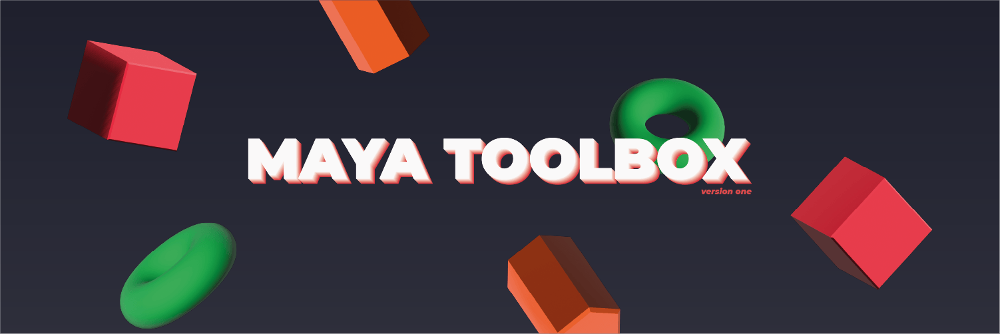
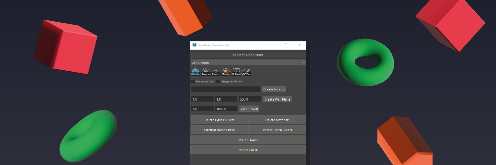

# Maya Toolbox 

<a href="https://github.com/KieronJenkins" target="_blank">
<a href="https://uk.linkedin.com/in/kieronjenkins" target="_blank">
<a href="https://www.python.org/" target="_blank">

## About
The toolbox was created at the request of artists to make their lives easier when creating assets for projects. Toolbox is currently in alpha testing.

## Two main objectives
1. The toolbox must have all the main tools artists use on a daily basis
2. The toolbox must be easy to use and easy to install

## Using the toolbox
In order to use the toolbox an artist must first create a button on their custom Maya shelf and set that button to work with Python not MEL, once set up the user can simply click the assigned button, a window will pop up with the most used tools. 

The tools vary from drop down boxes to checkboxes to buttons.
  

## Why create a toolbox
Artists only have so much time during the day and having to repeat tasks that can be automated daily is never a fun idea, this is where the toolbox steps in by putting all the most used tools in one place saving artists time and allows for a more efficient asset creation pipeline.

